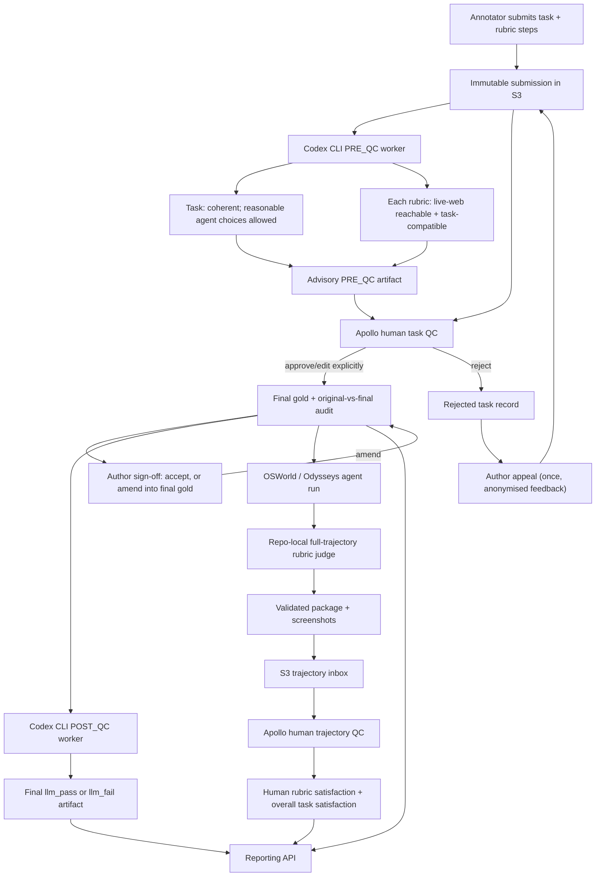

# Apollo quality-control flow

The same reviewed lifecycle runs in two isolated queue families: Apollo V2 uses
`v2-review/` through `journeys-presign`; Apollo PC uses `pc-review/` through
`journeys-pc-presign`. Collection data and review state never cross between them.



## Where work happens

| Stage | Execution location | Output |
|---|---|---|
| Task authoring | Apollo V2 browser/desktop or Apollo PC browser | V2 task upload, or a privacy-safe PC task sidecar; then an inbox marker under the matching review root |
| LLM task PRE_QC | Dedicated Codex CLI worker/VM with `--queue v2` or `--queue pc` | `{review-root}/llm_pre_qc_{pass,attention}/` |
| Human task QC | V2 `#/review-queue` or PC `#/review-task` | final, rejected, audit, and reviewer records under the matching root |
| Author sign-off / appeal | V2 `#/my-tasks` | sign-off receipts, archived prior final gold, or a one-time appeal revision under `v2-review/` |
| LLM task POST_QC | Dedicated Codex CLI worker/VM with the matching queue | `{review-root}/llm_{pass,fail}/` |
| Agent model run | Existing OSWorld/Odysseys runner | local/EFS run directory with `steps.jsonl` or `traj.jsonl` and screenshots |
| Trajectory LLM judge | `scripts/trajectory_review/run.py` with the matching queue | resumable evaluator JSON and immutable package under `{review-root}/trajectory-runs/` |
| Human trajectory QC | V2 `#/trajectory-review` or PC `#/grade`, assigned to the original task creator | `{review-root}/trajectory-judgments/` and done marker |
| OSWorld export | `scripts/trajectory_review/export_osworld.py` after a complete human `YES` | stock OSWorld examples/meta plus `tasks.json` |
| Reporting | the matching authenticated read-only API | complete tasks/rubrics, LLM QC, queue state, and human judgments for one app |

## Reviewer experience

Task reviewers see the immutable submitted task beside a working copy, Task coherence and Live-web feasibility, Reachable and Compatible status for every rubric, evidence, and only independently verified suggestions. A suggestion changes the working copy only after the reviewer clicks the apply button.

Authors see their own work in `#/my-tasks`. An approval shows original and reviewed versions side by side without identifying the reviewer, and can be accepted or amended; the complete result is stored under `v2-review/author-approved/`. A rejection shows its reason and step-level notes with the same anonymity, and permits one appeal with an author-written rationale. The rejecting reviewer is excluded and the rationale is shown to a fresh reviewer.

Trajectory graders see the prompt and rubric/verifier text only as reference, plus chronological screenshots and actions. They independently mark each rubric `Pass`, `Fail`, or `Unclear`, then give the same overall task-satisfaction verdict. The LLM trajectory judgment is deliberately hidden until the human submits, so it cannot bias the grade. Prompt quality and rubric correctness are handled in human task QC, not repeated here.

Only the expert who originally authored a task receives its trajectory in
Grade. `EDIT_NEEDED` creates a linked revision and sends that revision through
Codex live audit and normal human task Review; the original task and model run
stay unchanged. `NEEDS_RERUN` leaves the task unchanged and waits for a newly
published run. A complete `YES` with every rubric marked `Pass` is eligible for
the read-only OSWorld export.

## Production trajectory command

```bash
python3 scripts/trajectory_review/run.py \
  --runs-dir /path/to/osworld-runs \
  --task-source-json /path/to/tasks.json \
  --model gemini-3.1-flash-lite-preview \
  --queue v2 \
  --num-workers 8 \
  --prod
```

Use `--queue pc` with PC tasks. Run the same command with `--plan --prod` first.
The plan validates assignments and AWS access without invoking a model or writing
anything. A queue/task-ID mismatch is rejected before publication.

## Immutability boundaries

- Automated judges never edit submissions, final gold, or human decisions.
- V2 and PC use different APIs, roles, review roots, and worker queue flags.
- PRE_QC and POST_QC artifacts are separate and content-addressed.
- Model-run files and LLM trajectory results are never overwritten by human judgments.
- A provider error is an `ERROR`, not a model failure.
- Human task reviewers approve or reject task definitions, and human trajectory graders establish final rubric and task-satisfaction verdicts. The deliberate exception is that an author may amend their already-approved task into new final gold without a second reviewer pass; the reviewer audit stays unchanged and the superseded version is archived.
