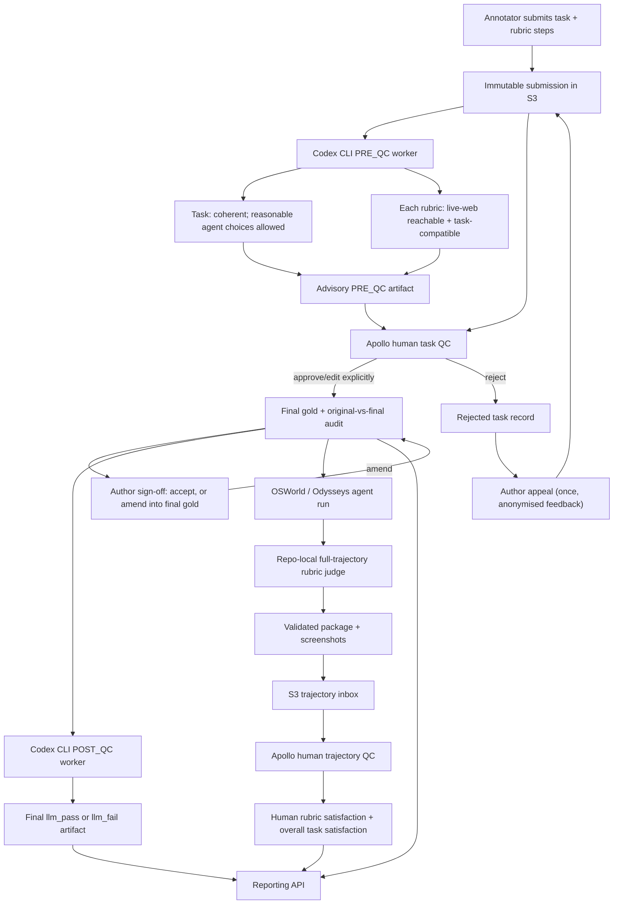

# Apollo quality-control flow



## Where work happens

| Stage | Execution location | Output |
|---|---|---|
| Task authoring | Apollo V2 browser/desktop client | `v2/{participant}/internal/task-*` plus review marker |
| LLM task PRE_QC | Dedicated Codex CLI worker/VM | `v2-review/llm_pre_qc_{pass,attention}/` |
| Human task QC | `https://apollo-v2-site.vercel.app/#/review-queue` | final, rejected, audit, and reviewer records |
| Author sign-off / appeal | `https://apollo-v2-site.vercel.app/#/my-tasks` | `v2-review/author-signoffs/`, archived prior final gold in `v2-review/finished-history/`, and appeal revisions in the task directory |
| LLM task POST_QC | Dedicated Codex CLI worker/VM | `v2-review/llm_{pass,fail}/` |
| Agent model run | Existing OSWorld/Odysseys runner | local/EFS run directory with `steps.jsonl` or `traj.jsonl` and screenshots |
| Trajectory LLM judge | `scripts/trajectory_review/run.py` locally, EC2, ECS, or Batch | resumable evaluator JSON, then immutable package |
| Human trajectory QC | `https://apollo-v2-site.vercel.app/#/trajectory-review` | `v2-review/trajectory-judgments/` and done marker |
| Reporting | authenticated read-only API | complete tasks/rubrics, LLM QC, queue state, and human judgments |

## Reviewer experience

Task reviewers see the immutable submitted task beside a working copy, Task coherence and Live-web feasibility, Reachable and Compatible status for every rubric, evidence, and only independently verified suggestions. A suggestion changes the working copy only after the reviewer clicks the apply button.

Authors see their own tasks at `#/my-tasks`. An approved task shows the reviewer's name, their original beside the final gold, and a choice: accept it, or edit the reviewer's version into a new final gold. A rejected task shows the reason and the reviewer's step-level notes with no name attached, and offers one appeal, which a different reviewer picks up.

Trajectory graders see the prompt and rubric/verifier text only as reference, plus chronological screenshots and actions. They independently mark each rubric `Pass`, `Fail`, or `Unclear`, then give the same overall task-satisfaction verdict. The LLM trajectory judgment is deliberately hidden until the human submits, so it cannot bias the grade. Prompt quality and rubric correctness are handled in human task QC, not repeated here.

## Production trajectory command

```bash
python3 scripts/trajectory_review/run.py \
  --runs-dir /path/to/osworld-runs \
  --task-source-json /path/to/tasks.json \
  --model gemini-3.1-flash-lite-preview \
  --num-workers 8 \
  --prod
```

Run the same command with `--plan --prod` first. The plan validates assignments and AWS access without invoking a model or writing anything.

## Immutability boundaries

- Automated judges never edit submissions, final gold, or human decisions.
- PRE_QC and POST_QC artifacts are separate and content-addressed.
- Model-run files and LLM trajectory results are never overwritten by human judgments.
- A provider error is an `ERROR`, not a model failure.
- Only human task reviewers approve or reject task definitions, and only human trajectory graders establish the final rubric and overall task-satisfaction verdicts. The one exception is the author of an already-approved task, who may amend it into new final gold — see the author sign-off stage in `QUALITY_CONTROL.md`. That path never touches the reviewer's audit of the original submission, and it archives the version it replaces.
